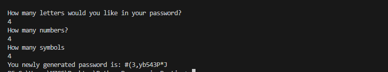

# Password Generator

A simple Python-based password generator for creating secure and random passwords.

## Features
- Generates strong, random passwords.
- Customizable length and character options.

## Built With
- Python 3.13.1
- Standard Python Libraries (`random`)

## Code Documentation
This project is well-documented with:
- Inline comments to explain key code sections.

## How It Works
1. The user provides input for the desired password length and character options.
2. The program combines character pools (e.g., letters, numbers, special characters).
3. A random password is generated by selecting characters from the combined pool.
4. The password is displayed to the user.

## Screenshots
Here’s what the program looks like in action:

